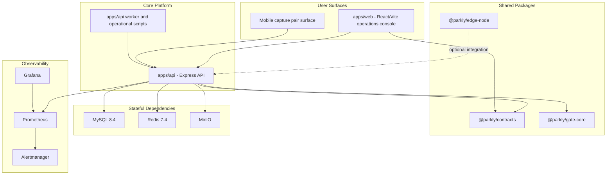

# Parkly Architecture

Architecture snapshot date: 2026-03-30
This document describes the runtime shape that is currently implemented in the repository.

## System Overview

Parkly is a monorepo for gate operations, parking monitoring, subscriptions, topology administration, and release-grade operations. The repository is organized around one backend, one web operations console, shared packages, and an optional edge package for local survivability work.

## Bounded Contexts

- `auth`: user login, refresh, session hygiene, admin session revocation, and password policy.
- `gate`: gate sessions, read ingestion, review queue, barrier command lifecycle, lane status, and outbox monitoring.
- `dashboard`: aggregate read models for overview, incidents, occupancy, lane health, and subscriptions.
- `topology`: site, lane, and device administration plus lane-device mapping.
- `subscriptions`: subscription master data, spot assignments, and vehicle assignments.
- `parking-live`: current occupancy board, spot detail, and floor or zone filters.
- `incidents`: operational incident list, detail, and resolution workflow.
- `audit`: append-only action history for privileged operations.
- `media`: user uploads and device-signed uploads with local or MinIO storage.
- `bulk-import`: enqueue and track administrative import jobs.
- `webhooks`: outbound integration endpoints and delivery history.

## Layering

- Interface layer: Express routes, middleware, SSE channels, and OpenAPI projection.
- Application layer: use-case modules under `apps/api/src/modules`.
- Domain and policy layer: decision engine, lane flow authority, tariff policy, site-scope rules, and canonical contract validation.
- Infrastructure layer: Prisma client, Flyway SQL migrations, Redis coordination, MinIO storage, Prometheus metrics, and shellable operational scripts.

## Runtime Data Paths

### Gate write path

1. Device-signed capture or operator action enters the API.
2. Auth and signature middleware validates the caller.
3. Lane and site scope are resolved.
4. Idempotency and lane coordination guard duplicate or conflicting writes.
5. Session state, reads, decisions, reviews, incidents, and barrier commands are written to MySQL.
6. Read-side status is exposed through REST and SSE.
7. Outbound delivery is staged through the outbox instead of inline webhook dispatch.

### Operator read path

1. Web console authenticates through `/api/auth/*`.
2. Dashboard and operational pages hydrate from REST snapshots.
3. SSE streams provide delta updates for lane status, device health, outbox, incidents, parking live, and gate event feeds.
4. Frontend route access is enforced by the same canonical role model used by the backend.

## Deployment Profiles

Parkly uses explicit deployment profiles in `apps/api/src/scripts/deployment-profiles.ts`.

| Profile | Intent | Media Driver | Compose Services |
| --- | --- | --- | --- |
| `local-dev` | Fast developer loop | `LOCAL` | MySQL, Redis |
| `demo` | Repeatable demo and CI-style smoke | `LOCAL` | MySQL, Redis |
| `release-candidate` | Production-like local verification | `MINIO` | MySQL, Redis, MinIO |

Observability services are brought up separately through the Compose `observability` profile.

## Repository Topology

- `apps/api`: Express API, worker jobs, migrations, Prisma schema, and operational scripts.
- `apps/web`: React/Vite SPA, Vitest unit tests, and Playwright E2E tests.
- `packages/contracts`: canonical Zod contracts and shared transport types.
- `packages/gate-core`: shared gate logic and canonical plate helpers.
- `packages/edge-node`: optional edge-node package for local survivability controller work.
- `infra/docker`: Compose definitions for local platform and observability services.
- `infra/observability`: Prometheus, Alertmanager, and Grafana provisioning.

## Quality and Release Architecture

- CI runs `pnpm test:full` from the repository root.
- The quality gate bootstraps a selected deployment profile before typecheck, API tests, web tests, and Playwright E2E.
- Playwright runs against a built SPA bundle, not a dev server, to catch production-only regressions.
- Security scanning is split across dependency review, audit artifact capture, and a separate CodeQL workflow.
